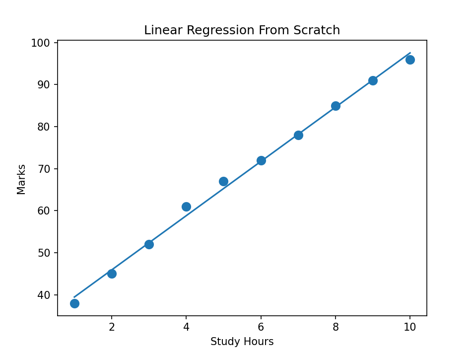
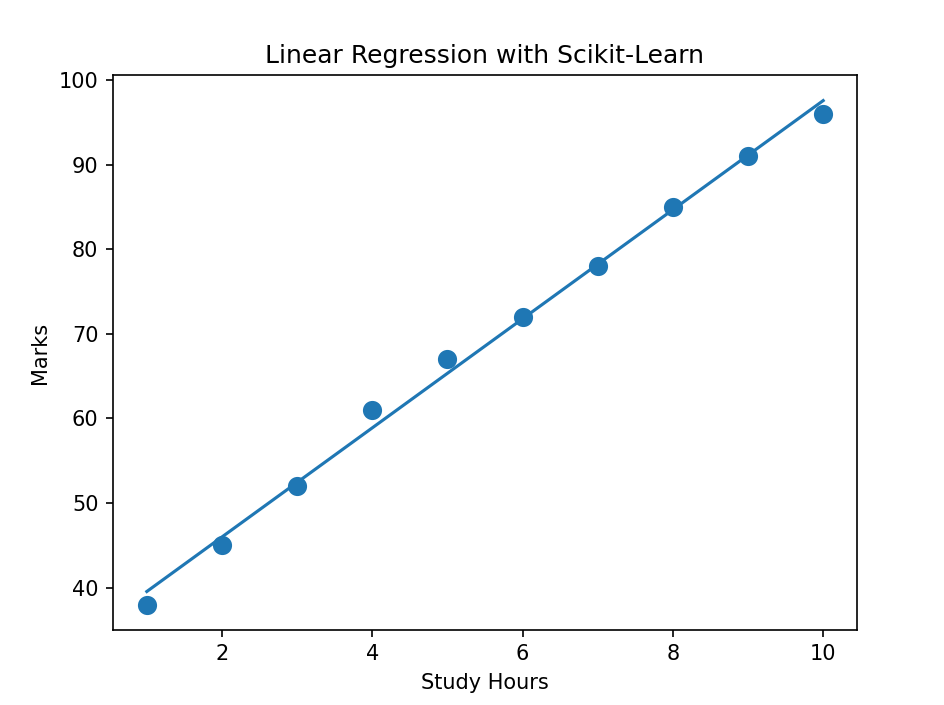

# 📘 Marks Predictor — Linear Regression Comparison

This repository compares two implementations of Linear Regression for predicting student marks based on study hours.

The goal of this project is to understand both:

- 📌 How Linear Regression works mathematically from scratch
- 📌 How Machine Learning libraries simplify the process

---

# 🚀 Projects Included

## 1️⃣ Linear Regression From Scratch

A custom implementation of Linear Regression using only Python and mathematics without external ML libraries.

### Features

- Manual slope & intercept calculation
- Prediction system
- No ML libraries used
- Seaborn graph visualization

---

## 2️⃣ Linear Regression Using Scikit-learn

An implementation using Scikit-learn's built-in Linear Regression model.

### Features

- Train-Test Split
- Model training using Scikit-learn
- Prediction system
- Seaborn graph visualization

---

# 📊 Graph Outputs

## 🔹 From Scratch Model



---

## 🔹 Scikit-learn Model



---

# 🧠 Concepts Used

- Linear Regression
- Supervised Learning
- Slope & Intercept
- Model Training
- Prediction
- Data Visualization

---

# 📂 Project Structure

```bash
Marks-Predictor/
│
├── Marks Predictor LR.py
├── Marka Predictor LR sklearn.py
├── scratch_graph.png
├── sklearn_graph.png
└── README.md
```

---

# 📈 Linear Regression Formula

y = mx + b

Where:

- y → Predicted Marks
- x → Study Hours
- m → Slope
- b → Intercept

---

# ⚖️ Comparison

| Feature | From Scratch | Scikit-learn |
|---|---|---|
| ML Library Used | ❌ No | ✅ Yes |
| Mathematical Understanding | ✅ High | ⚠️ Medium |
| Simplicity | ⚠️ Medium | ✅ Easy |
| Industry Standard | ❌ No | ✅ Yes |
| Learning Purpose | ✅ Excellent | ✅ Excellent |

---

# ▶️ Installation

Install required libraries:

```bash
pip install scikit-learn seaborn matplotlib
```

---

# ▶️ Run The Projects

## From Scratch Version

```bash
python "Marks Predictor LR.py"
```

## Scikit-learn Version

```bash
python "Marks Predictor LR sklearn.py"
```

---

# 💻 Example Output

```bash
Enter study hours: 8
Predicted Score: 84.7
```

---

# 🛠️ Technologies Used

- Python
- Scikit-learn
- Seaborn
- Matplotlib

---

# 🎯 Learning Outcome

This project helped me understand:

- How Linear Regression works internally
- How ML libraries simplify development
- The difference between manual implementation and library-based implementation
- Data visualization using Seaborn

---

# ⭐ Future Improvements

- Build GUI version
- Create Streamlit web app
- Add model accuracy metrics
- Support multiple features

```
